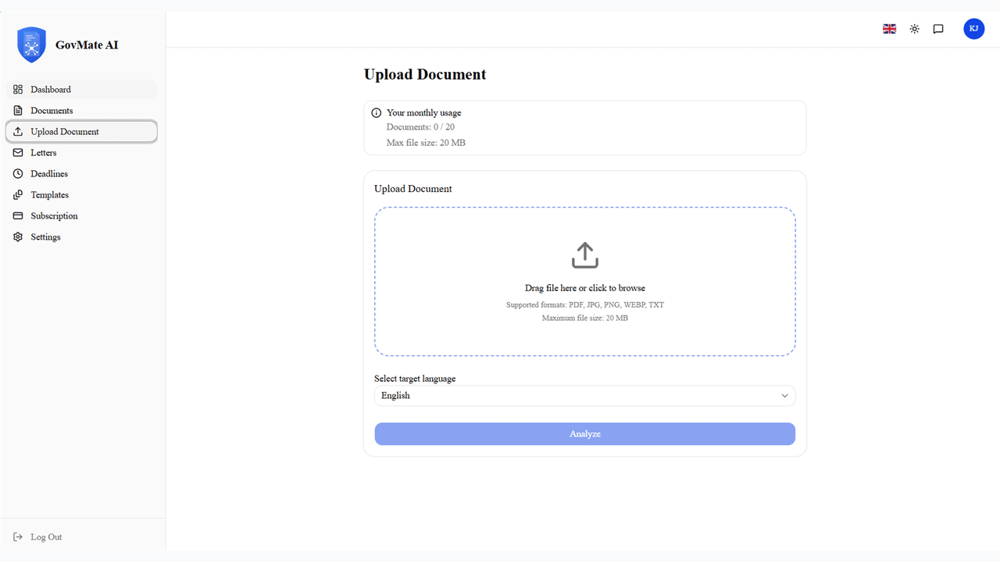
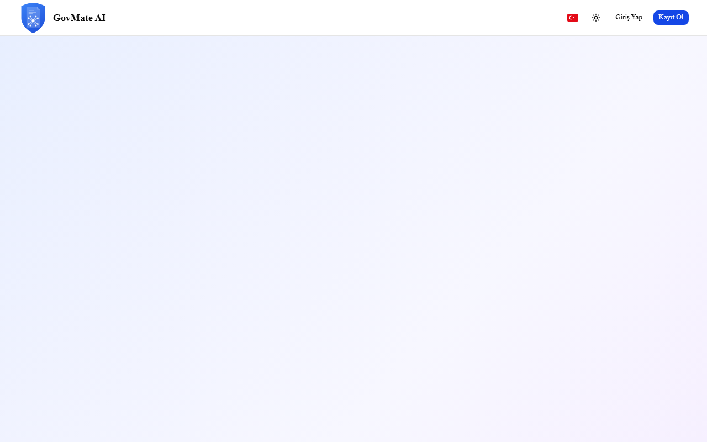
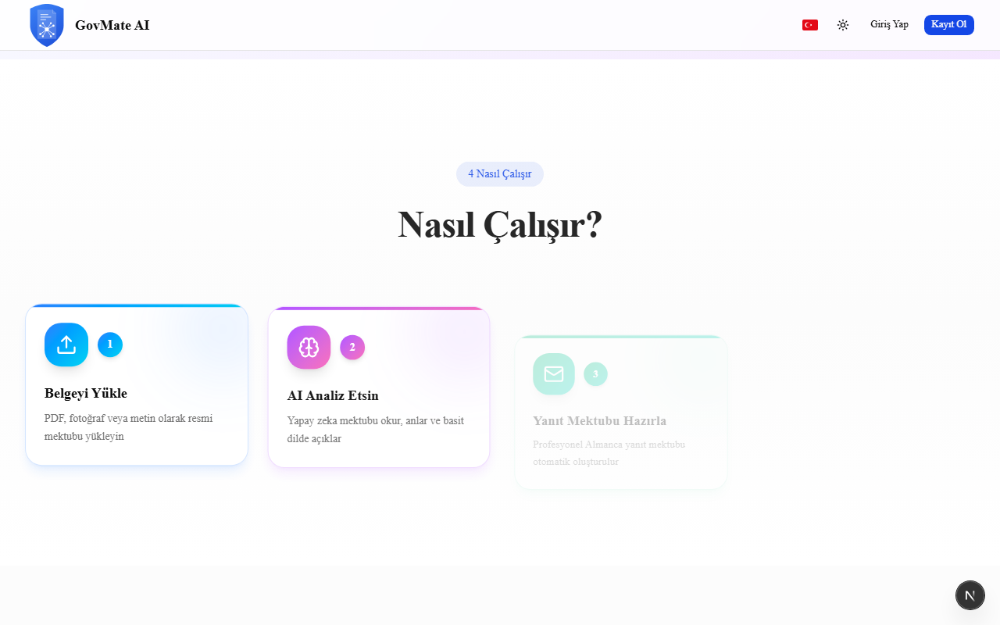
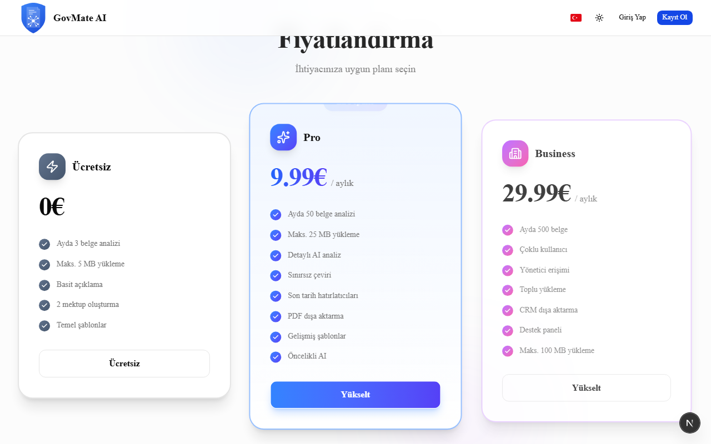
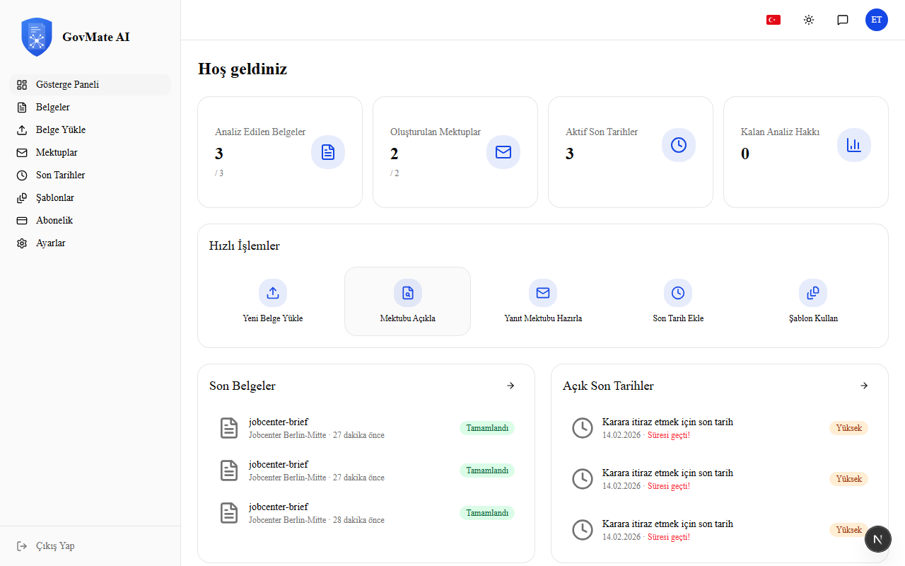
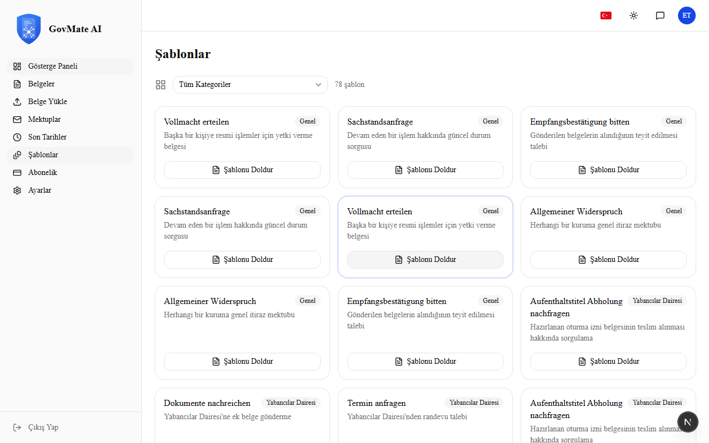
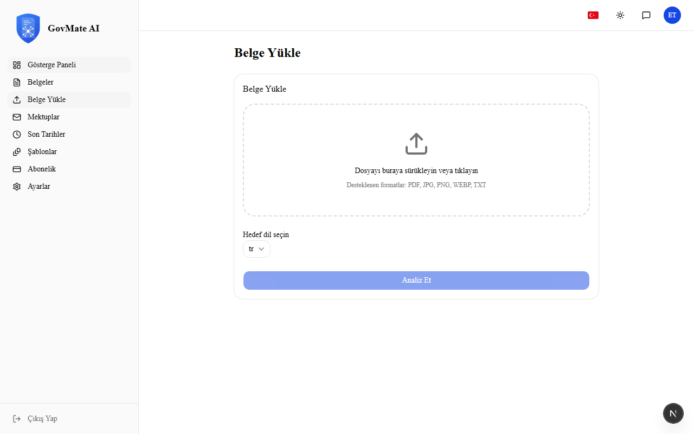
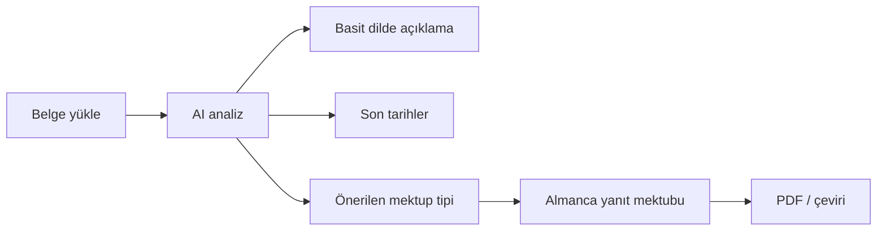

<div align="center">

# GovMate AI

**Almanya'daki resmi yazışmalarınızı yapay zeka ile anlayın, yanıtlayın ve takip edin.**

[](https://nextjs.org/)
[](https://www.typescriptlang.org/)
[](https://supabase.com/)
[](https://openai.com/)
[](LICENSE)

[Önizleme](#-önizleme) · [Özellikler](#-özellikler) · [Nasıl Çalışır](#-nasıl-çalışır) · [Kurulum](#-kurulum) · [Komutlar](#-komutlar) · [Güvenlik](#-güvenlik)

</div>

---

## Hakkında

**GovMate AI**, Almanya'da yaşayan kullanıcılar için tasarlanmış tam kapsamlı bir web uygulamasıdır. Jobcenter, Ausländerbehörde, Krankenkasse ve diğer resmi kurumlardan gelen mektupları yükleyebilir; sistem belgeyi analiz eder, basit dilde açıklar, son tarihleri çıkarır ve profesyonel Almanca yanıt mektupları üretir.

> Bu proje yasal danışmanlık sunmaz. Üretilen metinler bilgilendirme amaçlıdır; önemli kararlar için yetkili mercilere veya avukata danışın.

---

## Önizleme

<div align="center">



<p><sub>Landing → Nasıl çalışır → Fiyatlandırma → Giriş (otomatik kayıt)</sub></p>

</div>

### Ekran görüntüleri

<table>
  <tr>
    <td align="center" width="50%">
      <strong>Ana sayfa</strong><br />
      
    </td>
    <td align="center" width="50%">
      <strong>Nasıl çalışır</strong><br />
      
    </td>
  </tr>
  <tr>
    <td align="center">
      <strong>Fiyatlandırma</strong><br />
      
    </td>
    <td align="center">
      <strong>Dashboard</strong><br />
      
    </td>
  </tr>
  <tr>
    <td align="center">
      <strong>Şablonlar</strong><br />
      
    </td>
    <td align="center">
      <strong>Belge yükleme</strong><br />
      
    </td>
  </tr>
</table>

> Görselleri yenilemek için: `npm run screenshots` ardından `npm run screenshots:gif` (ffmpeg gerekir).

---

## Özellikler

### Kullanıcı paneli

| Özellik | Açıklama |
|--------|----------|
| Belge yükleme | PDF, görsel ve metin desteği |
| AI analiz | Mektubun özeti, riskler ve önerilen adımlar |
| Son tarih takibi | Otomatik deadline çıkarma ve hatırlatıcılar |
| Mektup oluşturma | Analize göre uygun şablon önerisi ve otomatik üretim |
| 78+ şablon | Jobcenter, BAMF, Bürgeramt, Versicherung ve daha fazlası |
| 7 dil arayüzü | TR · DE · EN · AZ · RU · UK · AR |
| PDF dışa aktarma | Hazır mektupları indirme |
| Abonelik | Stripe ile Pro / Business planları |

### Yönetim paneli

- Kullanıcı, rol ve abonelik yönetimi
- Şablon ve kategori düzenleme (7 dil)
- Duyuru, site içeriği ve geri bildirim
- AI ayarları, plan limitleri ve denetim logları
- **Admin** ve **Support** rolleri

### Kalite ve güvenlik

- Row Level Security (RLS) ile veri izolasyonu
- Dosya doğrulama, rate limiting, audit log
- Vitest unit testleri + Playwright E2E
- i18n senkron kontrolü (`npm run check:i18n`)
- Sentry hata izleme

---

## Nasıl Çalışır



1. **Yükle** — Resmi mektubu PDF, fotoğraf veya metin olarak ekle.
2. **Anla** — AI içeriği özetler; itiraz süresi gibi kritik noktaları vurgular.
3. **Yanıtla** — Uygun şablondan profesyonel Almanca mektup oluştur.
4. **Takip et** — Son tarihleri panelden izle, hatırlatıcı al.

---

## Teknoloji

| Katman | Teknoloji |
|--------|-----------|
| Framework | Next.js 16 (App Router), React 19, TypeScript |
| UI | Tailwind CSS 4, shadcn/ui, Framer Motion, Lucide |
| Veritabanı | Supabase (PostgreSQL + Auth + Storage) |
| AI | OpenAI API |
| Ödeme | Stripe Billing |
| E-posta | Resend |
| i18n | next-intl |
| Test | Vitest, Playwright |
| Deploy | Vercel uyumlu |

---

## Kurulum

### Gereksinimler

- Node.js 20+
- npm
- [Supabase](https://supabase.com) projesi
- [OpenAI](https://platform.openai.com) API anahtarı
- (Opsiyonel) [Stripe](https://stripe.com) ve [Resend](https://resend.com)

### 1. Depoyu klonla

```bash
git clone https://github.com/xeyal9032/govmate-ai.git
cd govmate-ai
npm install
```

### 2. Ortam değişkenleri

```bash
cp .env.example .env.local
```

| Değişken | Açıklama |
|----------|----------|
| `NEXT_PUBLIC_SUPABASE_URL` | Supabase proje URL |
| `NEXT_PUBLIC_SUPABASE_ANON_KEY` | Anon (public) anahtar |
| `SUPABASE_SERVICE_ROLE_KEY` | Sunucu tarafı işlemler |
| `OPENAI_API_KEY` | Belge analizi ve mektup üretimi |
| `STRIPE_*` | Abonelik ve webhook |
| `NEXT_PUBLIC_APP_URL` | Uygulama kök URL (örn. `http://localhost:3000`) |
| `CRON_SECRET` | Hatırlatıcı cron endpoint koruması |
| `E2E_USER_*` | Playwright test kullanıcısı |

### 3. Veritabanı

`supabase/migrations/` altındaki SQL dosyalarını sırayla çalıştırın:

```bash
npx supabase db push
```

Veya Supabase SQL Editor'da `001` … `010` dosyalarını sırayla uygulayın.

### 4. Geliştirme sunucusu

```bash
npm run dev
```

Tarayıcıda: [http://localhost:3000](http://localhost:3000)

### 5. Admin kullanıcı

Supabase Dashboard → Authentication ile kullanıcı oluşturun, ardından SQL Editor:

```sql
UPDATE profiles SET role = 'admin' WHERE email = 'sizin@email.com';
```

---

## Komutlar

| Komut | Açıklama |
|-------|----------|
| `npm run dev` | Geliştirme sunucusu |
| `npm run build` | Production build |
| `npm run start` | Production sunucu |
| `npm run lint` | ESLint |
| `npm run test` | Vitest unit testleri |
| `npm run test:e2e` | Playwright E2E |
| `npm run e2e:setup` | E2E test kullanıcısını Supabase'de oluşturur |
| `npm run check:i18n` | 7 dil çeviri senkron kontrolü |
| `npm run screenshots` | README için PNG ekran görüntüleri (`docs/screenshots/`) |
| `npm run screenshots:gif` | Karelerden `demo.gif` üretir |
| `npm run verify` | i18n + test + lint + build |
| `npm run verify:all` | `verify` + E2E |

---

## Proje yapısı

```
govmate-ai/
├── src/
│   ├── app/              # Next.js App Router (locale, dashboard, admin, API)
│   ├── components/       # UI bileşenleri
│   ├── actions/          # Server Actions
│   ├── lib/              # AI, Supabase, güvenlik, PDF
│   └── hooks/            # React hooks
├── messages/             # 7 dil çeviri dosyaları
├── supabase/migrations/  # Veritabanı şeması ve seed
├── e2e/                  # Playwright senaryoları
└── scripts/              # i18n ve E2E yardımcıları
```

---

## Deploy (Vercel)

1. [Vercel](https://vercel.com) üzerinde GitHub reposunu import edin.
2. `.env.local` içindeki tüm değişkenleri Vercel **Environment Variables** bölümüne ekleyin.
3. Stripe webhook URL: `https://alanadiniz.com/api/stripe/webhook`
4. Cron (hatırlatıcılar): `vercel.json` ile `/api/cron/reminders`

---

## Güvenlik

- Tüm kullanıcı verilerinde **RLS** aktif
- Kullanıcılar yalnızca kendi belgelerini görür
- Admin, varsayılan olarak belge içeriğine erişemez
- Dosya erişimi imzalı URL ile
- MIME tipi ve boyut doğrulaması
- Kritik işlemler için audit log

---

## Desteklenen kurumlar (örnek)

Jobcenter · Ausländerbehörde · Finanzamt · Krankenkasse · Familienkasse · BAMF · Bürgeramt · Rentenversicherung · Schule · Versicherung ve genel şablonlar

---

## Lisans

**Proprietary** — Tüm hakları saklıdır. İzinsiz kopyalama ve dağıtım yasaktır.

---

<div align="center">

**[github.com/xeyal9032/govmate-ai](https://github.com/xeyal9032/govmate-ai)**

Geliştirici: [@xeyal9032](https://github.com/xeyal9032)

</div>
